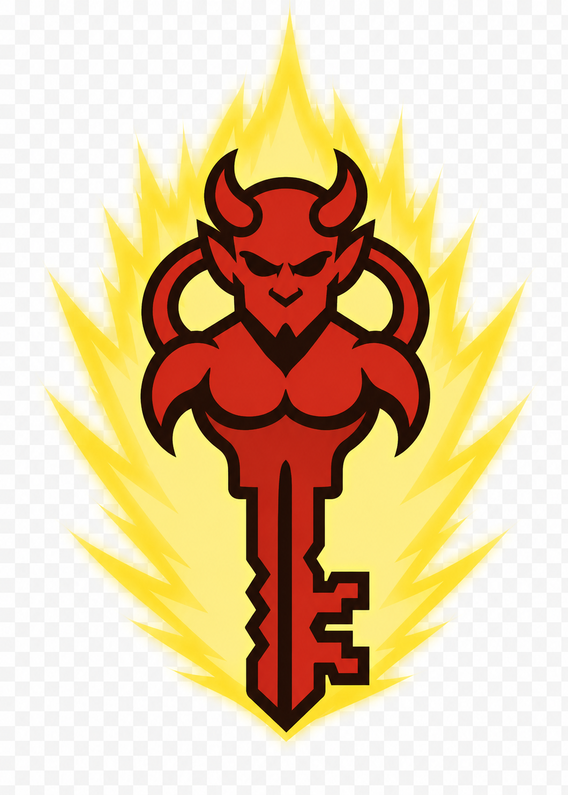

<p align="center">
  
</p>

# keydaemon

**A lightweight, programmable keyboard/mouse automation daemon** — a clean Python API and CLI instead of a GUI macro recorder. It runs quietly in the background: autoclickers, anti-AFK loops, text expansion, form filling, drawing, and pixel-watching.

!!! warning "Know where to point it"
    **Not for** kernel-level anti-cheat games (Valorant, Fortnite, PUBG).
    **Fine for** Minecraft, singleplayer/private servers, productivity, and desktop automation.

---

## Install

```bash
git clone https://github.com/MLMecham/keydeamon
cd keydeamon
uv sync --extra dev        # install with dev/test dependencies
uv run keydaemon --help    # the CLI
```

Want `keydaemon` available in every terminal? Install it as a uv tool:

```bash
uv tool install --editable .
```

## The first 30 seconds

```bash
keydaemon run autoclicker
```

```text
First run of built-in preset 'autoclicker' - installed ...\macros\autoclicker.toml
Emergency kill: <ctrl>+<shift>+<alt>+<f12>  (or: keydaemon stop)
Autoclicker preset.
Press F6 to start/stop. Press F8 to quit.
Running 'autoclicker'. Ctrl+C to stop.
```

Hover over your target, press ++f6++, and the daemon clicks ~4×/second with human-ish jitter until you press ++f6++ again. ++f8++ quits. The preset installed itself as an ordinary TOML file — edit it to make it yours.

## Two ways to define a macro

=== "Python — the fluent builder"

    ```python
    import keydaemon

    # Press space every 60s (±5s jitter), forever:
    keydaemon.macro().every(60).jitter(5).tap("space").loop().run()

    # Hotkey-armed clicker: F6 toggles, Esc quits.
    keydaemon.macro().every(0.1).click("left").loop().hotkey("f6").exit_key("esc").run().join()
    ```

=== "TOML — a file in your macros dir"

    ```toml
    [trigger]
    type = "manual"
    hotkey = "f6"      # press to start/stop
    mode = "toggle"

    [behavior]
    every = 0.1
    jitter = 0.02
    repeat = -1        # loop until toggled off

    [actions]
    sequence = ["click:left"]
    ```

    Save as `clicker.toml` in the macros dir (or scaffold one with
    `keydaemon new clicker --type manual`), then `keydaemon run clicker`.

## Triggers — *when* a macro fires

| Trigger | How it starts | Builder / TOML |
|---|---|---|
| **Loop** | Immediately, on a timer | `.every(s).loop()` — `type = "loop"` |
| **Hotkey** | When you press a key (toggle or once) | `.hotkey(key, mode)` — `type = "manual"`, `hotkey`, `mode` |
| **Expand** | When you type a text pattern | `type = "expand"`, `pattern` |
| **Profile** | Starts several macros together | `type = "profile"`, `macros.run = [...]` |

## The daemon always lets go

Automation that injects input needs a way out that *cannot fail*. keydaemon's kill hierarchy is the core of its design — a reserved hardware combo no macro can bind or fake, sanctioned `stop:self` / `stop:all` actions for macros that need to bail out, and held-input tracking so a stopped macro never leaves a key stuck down.

[Read the safety model :material-arrow-right:](safety.md){ .md-button .md-button--primary }

## Where things live

```text
<user_data_dir>/keydaemon/     # %LOCALAPPDATA%\keydaemon\keydaemon on Windows
    macros/                    # one TOML per macro — presets install here too
    pids/                      # one PID file per detached run
    keydaemon.log              # output from --detach runs
```
