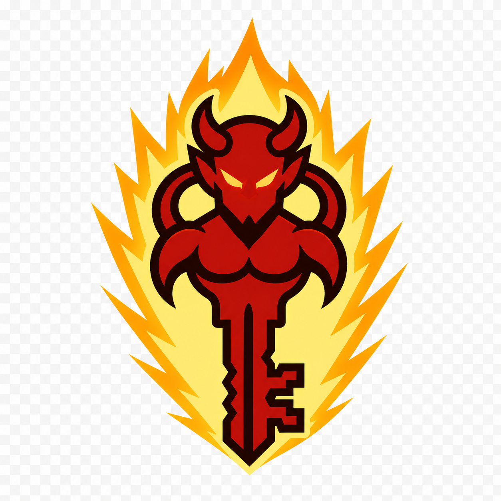

<p align="center">
  
</p>

# Safety & Kill Keys

A program that presses keys and clicks the mouse for you must be *harder to lose control of than it is to start*. Everything on this page exists so that no matter what a macro does — loops forever, holds Shift, spawns children behind a hotkey — you always get your keyboard back.

## The kill hierarchy

### :material-fire: Tier 1 — the emergency kill combo

++ctrl+shift+alt+f12++ stops **everything, always**.

- Every keydaemon process listens for it — foreground, detached, all of them at once.
- It is **hardcoded and not configurable**. A kill switch you can reconfigure is a kill switch you can lose.
- It is **unreachable from macros**. The loader and the Python builder both refuse any macro that:
    - binds the combo as its `hotkey` or `exit_key` (left/right modifier variants included), **or**
    - synthesizes it — presses ctrl, shift, and alt without releasing them, then touches ++f12++.

```text
KillKeyError: Macro 'evil' binds its hotkey to the emergency kill combo
(<ctrl>+<shift>+<alt>+<f12>). That combo is reserved so it always works.
To stop macros from within a macro, use the 'stop:self' / 'stop:all'
actions (.stop_self() / .kill_all() in Python) instead.
```

When the eye opens, the daemon lets go. No exceptions, no overrides.

### :material-key: Tier 2 — sanctioned kill actions

Macros *can* invoke kill semantics — through the front door, not by touching the reserved combo:

| Action | Python | Scope |
|---|---|---|
| `exit_key = "f8"` | `.exit_key("f8")` | Real keypress stops this macro's profile |
| `stop:self` | `.stop_self()` | The macro stops its own runner and any children |
| `stop:all` | `.kill_all()` | Everything in the process — same effect as the hardware combo |

Built with future conditionals in mind — the "something looks wrong, abort everything" pattern:

```toml
[actions]
sequence = [
    "wait_for_color:960,540:#FF0000",   # the screen went red...
    "stop:all",                          # ...kill all automation
]
```

### :material-console: Tier 3 — from outside

```bash
keydaemon stop            # stop every detached run
keydaemon stop clicker    # stop one detached run by name
```

```python
keydaemon.stop_all()      # Python: ordered teardown + backstop sweep
```

## No stuck keys, no stray events

keydaemon tracks every input a macro is *holding* — mouse buttons **and** keyboard keys. Any stop path releases exactly those and nothing else:

- `press("shift")` then stop → Shift is released. No more walking away while your character sneaks in a corner.
- A plain clicker holds nothing → its stop injects **zero** events. (Releasing buttons that were never pressed is how you get mystery right-click menus popping open.)
- Taps aren't tracked — a tap always completes its own press→release, so "releasing" it again would inject exactly the spurious event this system exists to prevent.

## No runaway threads

Every runner auto-registers in a global backstop the moment it is constructed — you *cannot* build one that escapes the sweep. `stop()` is idempotent and cascades children-first, so a hotkey supervisor always tears down its running loop before releasing its own listener. `stop_all()` does both an ordered profile teardown *and* a flat sweep of every runner ever created.

!!! note "One honest limitation"
    `keydaemon stop` on a *detached* process is an external hard kill (`taskkill`), so a detached macro holding a key at that exact moment can't release it. Every in-process path — exit key, the kill combo, `stop:self`/`stop:all`, natural completion — releases properly. Prefer the kill combo over `keydaemon stop` if a detached macro is misbehaving; it stops the process from the inside.
